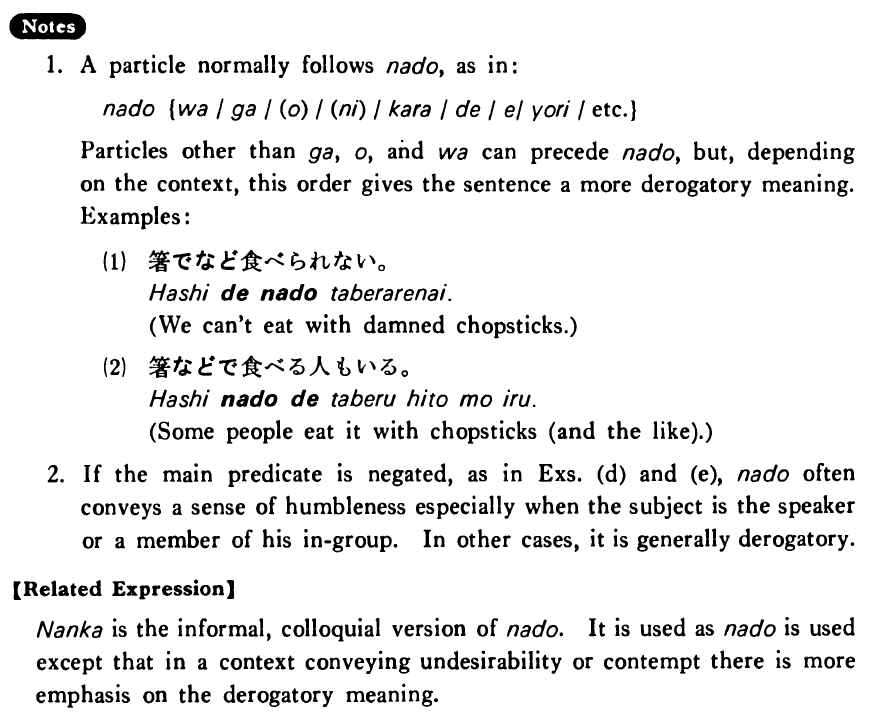

# など

 
 
 
 

## Summary

<table><tr>   <td>Summary</td>   <td>A marker that indicates exemplification.</td></tr><tr>   <td>English</td>   <td>And so on; and the like; for example; things like ~</td></tr><tr>   <td>Part of speech</td>   <td>Particle</td></tr><tr>   <td>Related expression</td>   <td>なんか</td></tr></table>

## Example Sentences

<table><tr>   <td>日本の食べ物の中では寿司や天ぷらなどが好きだ・好きです。</td>   <td>Among Japanese foods I like things like sushi and tempura.</td></tr><tr>   <td>A:冬休みはどこに行きましょうか。  B:ハワイなどどうですか。</td>   <td>A: Where shall we go during the winter vacation?&emsp;&emsp;B: How about Hawaii, for example?</td></tr><tr>   <td>大学ではフランス語やドイツ語などを勉強した。</td>   <td>In college I studied French and German and the like.</td></tr><tr>   <td>この大学には中国や韓国などから学生が大勢来ます。</td>   <td>A lot of students from China, Korea and so on come to this college.</td></tr><tr>   <td>A:経済学を専攻するつもりですか。  B:いいえ、経済学など専攻するつもりはありません。</td>   <td>A: Are you going to major in economics?&emsp;&emsp;B: No, I have no intention of majoring in things like economics.</td></tr><tr>   <td>A:この翻訳をして下さいませんか。  B:こんな難しいもの、私などには出来ません。</td>   <td>A: Could you kindly translate this for me?&emsp;&emsp;B: A person like me cannot translate such a difficult thing.</td></tr></table>

## Explanation

1. A particle normally follows など, as in:
  <ul> <li>など {は/が/(を)/(に)/から/で/へ/より/etc.}</li> </ul>  
Particles other than が, を, and は can precede など, but, depending on the context, this order gives the sentence a more derogatory meaning. Examples:
  <ul>(1) <li>箸でなど食べられない。</li> <li>We can't eat with damned chopsticks.</li> </ul>  <ul>(2) <li>箸などで食べる人もいる。</li> <li>Some people eat it with chopsticks (and the like).</li> </ul>  
If the main predicate is negated, as in Examples (d) and (e), など often conveys a sense of humbleness especially when the subject is the speaker or a member of his in-group. In other cases, it is generally derogatory.
  
【Related Expression】
  
なか is the informal, colloquial version of など. It is used as など is used except that in a context conveying undesirability or contempt there is more emphasis on the derogatory meaning.

## Grammar Book Page

