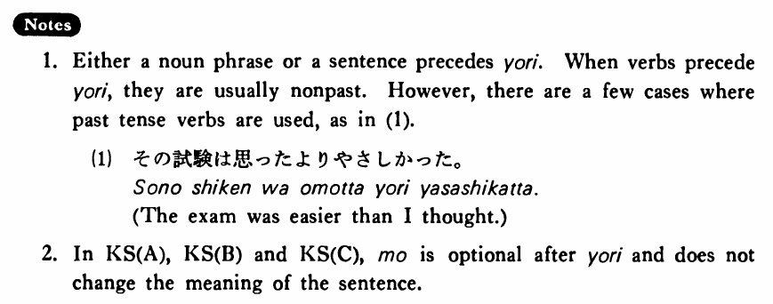

# より (1)

[1. Summary](#summary) 
[2. Formation](#formation) 
[3. Example Sentences](#example-sentences) 
[4. Explanation](#explanation) 
[5. Grammar Book Page](#grammar-book-page) 

## Summary

<table><tr>   <td>Summary</td>   <td>A particle which indicates that something/someone is being compared with something/someone.</td></tr><tr>   <td>English</td>   <td>Than; rather ~ than ~; more ~ than ~</td></tr><tr>   <td>Part of speech</td>   <td>Particle</td></tr><tr>   <td>Related expression</td>   <td>方が~より</td></tr></table>

## Formation

<table class="table"> <tbody><tr class="tr head"> <td class="td">(i)  Noun</td> <td class="td">より </td> <td class="td">&nbsp;</td> </tr> <tr class="tr"> <td class="td">&nbsp;</td> <td class="td">これより </td> <td class="td">Than    this</td> </tr> <tr class="tr head"> <td class="td">(ii)  {V/Adjective い}    informal nonpast</td> <td class="td">より </td> <td class="td">&nbsp;</td> </tr> <tr class="tr"> <td class="td">&nbsp;</td> <td class="td">話すより </td> <td class="td">Than    talking</td> </tr> <tr class="tr"> <td class="td">&nbsp;</td> <td class="td">高いより </td> <td class="td">Than    being expensive</td> </tr> <tr class="tr head"> <td class="td">(iii)  Adjective な stem</td> <td class="td">なより </td> <td class="td">&nbsp;</td> </tr> <tr class="tr"> <td class="td">&nbsp;</td> <td class="td">静かなより </td> <td class="td">Than    being quiet</td> </tr> <tr class="tr head"> <td class="td">(iv)  Noun</td> <td class="td">であるより </td> <td class="td">&nbsp;</td> </tr> <tr class="tr"> <td class="td">&nbsp;</td> <td class="td">先生であるより </td> <td class="td">Than    being a teacher</td> </tr></tbody></table>

## Example Sentences

<table><tr>   <td>日本語はスペイン語より（も）面白い・面白いです。</td>   <td>Japanese is more interesting than Spanish.</td></tr><tr>   <td>車で行くほうがバスで行くより（も）安い・安いです。</td>   <td>Going by car is cheaper than going by bus.</td></tr><tr>   <td>私は旅行するより（も）うちにいたい・いたいです。</td>   <td>I'd rather stay at home than go on a trip.</td></tr><tr>   <td>これより（ほか（に））方法はない・ありません。バスで行くより（ほか（に））仕方がない・ありません。</td>   <td>There is no other way than this. There is no other way than to go by bus.</td></tr><tr>   <td>漢字は平仮名より難しい。</td>   <td>Kanji is more difficult than hiragana.</td></tr><tr>   <td>林さんは私より速く走れる。</td>   <td>Mr. Hayashi can run faster than I can.</td></tr><tr>   <td>僕はステーキより魚の方が好きだ。</td>   <td>I prefer fish to steak.</td></tr><tr>   <td>図書館で勉強するほうが家で勉強するよりよく出来る。</td>   <td>Studying at the library is more productive than studying at home.</td></tr><tr>   <td>それは赤と言うより茶色に近かった。</td>   <td>That was closer to brown rather than saying it was red.</td></tr><tr>   <td>日本語を勉強したかったら、アメリカの学校で勉強するより日本へ行きなさい。</td>   <td>If you want to study Japanese, go to Japan rather than studying at a school in America.</td></tr></table>

## Explanation

1. Either a noun phrase or a sentence precedes より. When verbs precede より, they are usually nonpast. However, there are a few cases where past tense verbs are used, as in (1).
  <ul>(1) <li>その試験は思ったよりやさしかった。</li> <li>The exam was easier than I thought.</li> </ul>  
2. In Key Sentence (A), Key Senence (B) and Key Sentence (C), も is optional after より and does not change the meaning ot the sentence.

## Grammar Book Page

