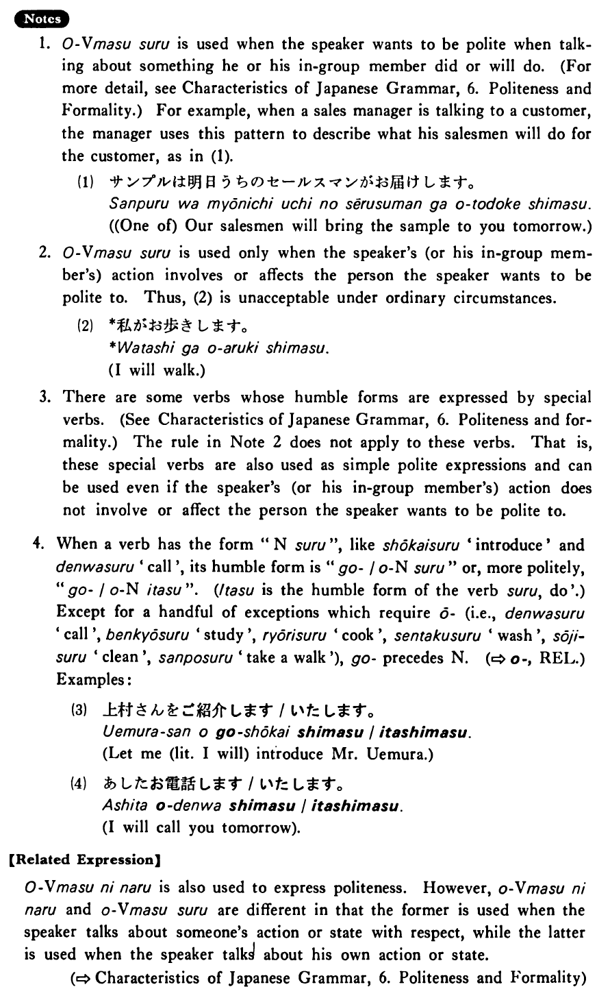

# お～する

[1. Summary](#summary) 
[2. Formation](#formation) 
[3. Example Sentences](#example-sentences) 
[4. Explanation](#explanation) 
 

## Summary

<table><tr>   <td>Summary</td>   <td>A phrase which humbly expresses the speaker’s politeness to someone when describing the speaker’s action or state that involves or affects that person.</td></tr><tr>   <td>Part of speech</td>   <td>Phrase</td></tr><tr>   <td>Related expression</td>   <td>お~になる</td></tr></table>

## Formation

<table class="table"> <tbody><tr class="tr head"> <td class="td">おVます </td> <td class="td">する </td> <td class="td">&nbsp;</td> </tr> <tr class="tr"> <td class="td">&nbsp;</td> <td class="td">お話しする </td> <td class="td">Someone    (will) talk</td> </tr> <tr class="tr"> <td class="td">&nbsp;</td> <td class="td">お教えする </td> <td class="td">Someone    (will) teach</td> </tr></tbody></table>

## Example Sentences

<table><tr>   <td>私は先生のスーツケースをお持ちした・しました。</td>   <td>I carried my teacher's suitcase.</td></tr><tr>   <td>そのことは私がお話ししましょう。</td>   <td>I will tell you about that matter.</td></tr><tr>   <td>山村君は先生に本をお借りした。</td>   <td>Mr. Yamamura borrowed a book from his teacher.</td></tr></table>

## Explanation

1. おVerbますする is used when the speaker wants to be polite when talking about something he or his in-group member did or will do. For example, when a sales manager is talking to a customer, the manager uses this pattern to describe what his salesmen will do for the customer, as in (1).
  <ul>(1) <li>サンプルはみょうにちうちのセ一ルスマンがお届けします。</li> <li>(One of) Our salesmen will bring the sample to you tomorrow.</li> </ul>  
2. おVerbますする is used only when the speaker's (or his in-group member's) action involves or affects the person the speaker wants to be polite to. Thus, (2) is unacceptable under ordinary circumstances.
  <ul>(2) <li>*私がお歩きします。</li> <li>I will walk.</li> </ul>  
3. There are some verbs whose humble forms are expressed by special verbs. The rule in Note 2 does not apply to these verbs. That is, these special verbs are also used as simple polite expressions and can be used even if the speaker's (or his in-group member's) action does not involve or affect the person the speaker wants to be polite to.
  
4. When a verb has the form "Nounする", like 紹介する 'introduce' and 電話する 'call', its humble form is "ご/おNounする" or, more politely, "ご/おNounいたす". (いたす is the humble form of the verb する, 'do'.) Except for a handful of exceptions which require お (i.e., 電話する 'call', 勉強する 'study', 料理する 'cook',  洗濯する 'wash', 掃除する 'clean', 散歩する 'take a walk'), ご precedes Noun. (⇨ <a href="#㊦ お">お</a>, Related Expression) Examples:
  <ul>(3) <li>上村さんをご紹介します/いたします。</li> <li>Let me (literally: I will) introduce Mr. Uemura.</li> </ul>  <ul>(4) <li>あしたお電話します/いたします。</li> <li>I will call you tomorrow.</li> </ul>  
【Related Expression】
  
おVerbますになる is also used to express politeness. However, おVerbますになる and おVerbますする are different in that the former is used when the speaker talks about someone's action or state with respect, while the latter is used when the speaker talks about his own action or state.

## Grammar Book Page

