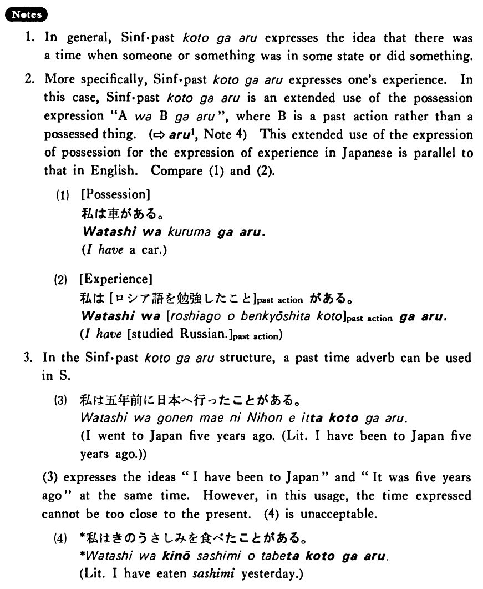

# ことがある (1)

[1. Summary](#summary) 
[2. Formation](#formation) 
[3. Example Sentences](#example-sentences) 
[4. Explanation](#explanation) 
 

## Summary

<table><tr>   <td>Summary</td>   <td>There was a time when ~</td></tr><tr>   <td>English</td>   <td>Someone has done something; someone has had an experience doing something; there was a time when ~</td></tr><tr>   <td>Part of speech</td>   <td>Phrase</td></tr></table>

## Formation

<table class="table"> <tbody><tr class="tr head"> <td class="td">Sinformal past</td> <td class="td">ことがある </td> <td class="td">&nbsp;</td> </tr> <tr class="tr"> <td class="td">&nbsp;</td> <td class="td">話したことがある </td> <td class="td">Have    talked</td> </tr> <tr class="tr"> <td class="td">&nbsp;</td> <td class="td">高かったことがある </td> <td class="td">There    was a time when something was expensive</td> </tr> <tr class="tr"> <td class="td">&nbsp;</td> <td class="td">静かだったことがある </td> <td class="td">There    was a time when something was quiet</td> </tr> <tr class="tr"> <td class="td">&nbsp;</td> <td class="td">先生だったことがある </td> <td class="td">There    was a time when someone was a teacher</td> </tr></tbody></table>

## Example Sentences

<table><tr>   <td>私はヨーロッパへ行ったことがある・あります。</td>   <td>I have been to Europe.</td></tr><tr>   <td>レタスがとても高かったことがある・あります。</td>   <td>There was a time when lettuce was very expensive.</td></tr><tr>   <td>私は中学校で英語を教えたことがあります。</td>   <td>I have taught English at a junior high school.</td></tr><tr>   <td>小川さんはまだゴルフをしたことがない。</td>   <td>Mr. Ogawa hasn't played golf yet.</td></tr><tr>   <td>私は日本の小説をよく読んだことがある。</td>   <td>There was a time when I read a lot of Japanese novels.</td></tr><tr>   <td>スーザンは一時ジャズがとても好きだったことがある。</td>   <td>There was a time when Susan liked jazz a lot.</td></tr><tr>   <td>私はプロ野球選手だったことがあります。</td>   <td>There was a time when I was a professional baseball player.</td></tr></table>

## Explanation

1. In general, Sentence informal past ことがある expresses the idea that there was a time when someone or something was in some state or did something.
  
2. More specifically, Sentence informal past ことがある expresses one's experience. In this case, Sentence informal past ことがある is an extended use of the possession expression "AはBがある", where B is a past action rather than a possessed thing. (⇨ <a href="#㊦ ある (1)">ある1</a>, Note 4) This extended use of the expression of possession for the expression of experience in Japanese is parallel to that in English. Compare (1) and (2).
  <ul>(1) [Possession] <li>私は車がある。</li> <li>I have a car.</li> </ul>  <ul>(2)[Experience] <li>私は [ロシア語を勉強したこと] past action がある。</li> <li>I have [studied Russian.] past action</li> </ul>  
3. In the Sentence informal past ことがある structure, a past time adverb can be used in the Sentence.
  <ul>(3) <li>私は五年前に日本へ行ったことがある。</li> <li>I went to Japan five years ago. (Literally: I have been to Japan five years ago.)</li> </ul>  
(3) expresses the ideas "I have been to Japan" and "It was five years ago" at the same time. However, in this usage, the time expressed cannot be too close to the present. (4) is unacceptable.
  <ul>(4) <li>*私はきのうさしみを食べたことがある。</li> <li>Literally: I have eaten sashimi yesterday.</li> </ul>

## Grammar Book Page

